# E-Vote

A decentralized and transparent Blockchain-based voting application, built with Flutter as the UI framework, a Solidity Smart contract as the Backend and MaticVigil Sidechain as the Database (Blockchain). 

## E-Vote Architecture Diagram
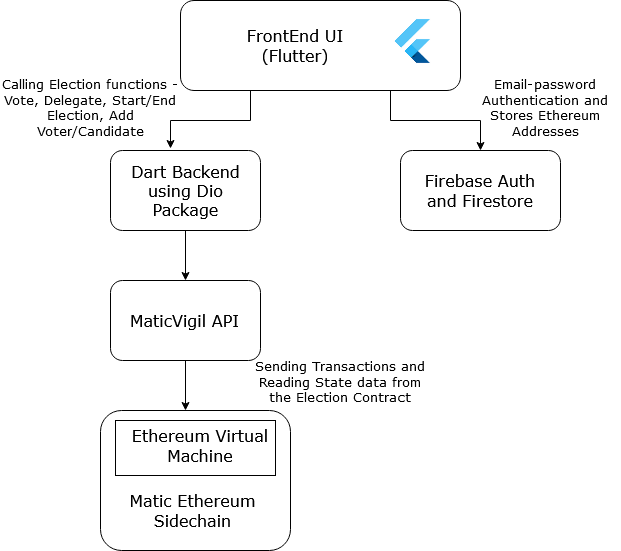

## Issues with the Current System of Voting 
1. Voting in most democratic states and organizations all over the world has been a largely centralized activity, with immense trust and faith placed in the hands of a small number of powerful people. 
2. Absence of a robust and secure authentication system for voters (like a biometric system).
3. Security issues with respect to the manipulation of EVMs - Rigging in elections is a major threat to democracy.
4. Another factor that negatively impacts the current system of Voting is the associated costs and other resources. For example, it was estimated that the Indian Lok Sabha Elections of 2019 cost $7 billion.
5. Both Digital Voting using EVMs and the Paper Ballot system have drawbacks - reliability, verifiability and security.

## What is Liquid Democracy?

Liquid democracy is similar to ‘delegative democracy’ which combines elements of both direct and representative democracy. 

It is essentially a scalable hybrid of direct and representative democracy, each of which has its disadvantages - direct democracy is not scalable and representative democracy is not reflective of democratic ideals, which is to put power in the hands of the people.

It enables people to vote directly, or assign their vote to individuals or organizations that they trust.

It is being proposed in order to strengthen democracy by increasing popular participation in everyday policy making.

## Running the Flutter App
1. Clone the repo.
2. Download the necessary packages required by Flutter by running `flutter pub get`.
3. Run the application on an emulator (on Android Studio) or use a physical device (Enable USB Debugging on the device) by running the command `flutter run`.

## Overview of Matic and reasons for its use

1. The current decentralized eco-system lacks usability and convenience and transactions are slow, expensive and complex. Most blockchain applications haven’t reached a stage of mass usage due to scalability and UI issues.
2. Matic Network is a Layer 2 scaling solution that achieves scale by utilizing side chains for off-chain computation while ensuring asset security using the Plasma framework and a DPoS validators.
3. MaticVigil API is an API gateway on top of the Matic network EVM-compatible sidechain which enables developers to write code to interact with value transfer and transactions on Matic as if it were just talking to a normal web server REST API over HTTP.
4. Due to the primitive stages of web3 libraries in Dart, I have chosen to use Matic to deploy and communicate with the smart contract.

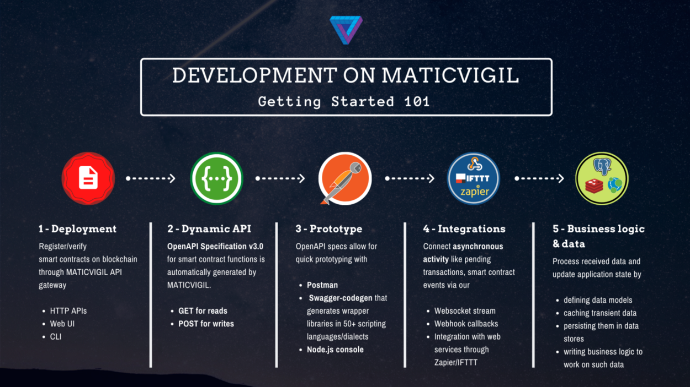

###### Source:https://medium.com/blockvigil/maticvigil-scalable-blockchain-api-for-everyone-2bc09489e602

## Deploying a new Smart contract to the Matic Network and running the app successfully

1. Start by configuring the app’s Firebase integration to your Google account - Create a new project in Firebase (https://console.firebase.google.com/u/0/ ), and integrate it with the app, enable Email-Password Authentication and Firestore Read/Write access.
2. Register as a user from an account - which will be the Admin of the election.
3.Create a collection called ‘users’ in the root folder - and add a new document, adding in three fields - 
- email - Set it to the email used in the previous step.
- admin - Set this field to true, it indicates whether the particular user is the admin or not
- address  - This is the 40-character long (42, including the leading ‘0x’) that will act as the Public Ethereum Address of the Administrator of the election. This can be generated randomly.
- Visit the MaticVigil Mainnet (An Ethereum Sidechain Solution that lets you deploy a smart contract to its network and creates an API for you)  website (https://mainnet.maticvigil.com/ ), create a new developer account and click on “Add a New Contract”
5. Copy the code present in contracts/Election.sol to the online IDE and Deploy it - Enter the appropriate description and and enter the admin address entered in the previous steps as the other argument and deploy the contract.
6. After the contract has been deployed to the Matic Network, copy the ‘Contract Address’ present on the contract dashboard and replace the existing contract address and admin address in backend/remote_datasource.dart as url and adminAddress respectively.
7. Run the Flutter app

## Screenshots of Working
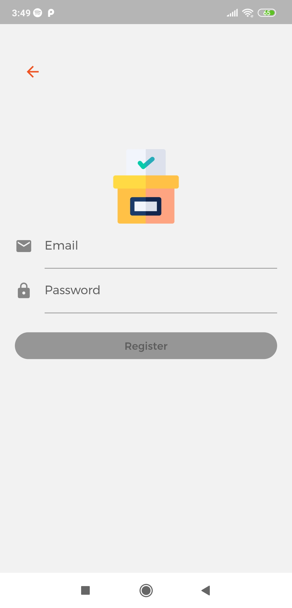&emsp;
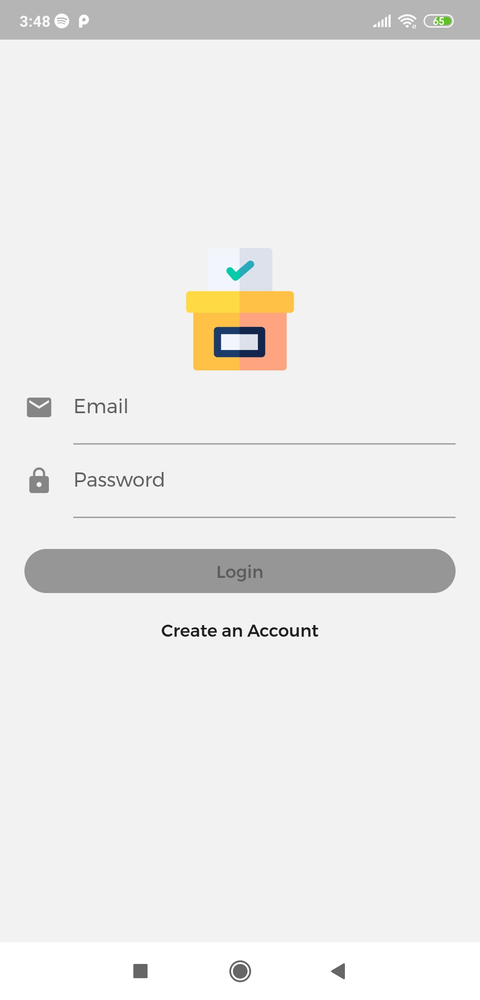&emsp;
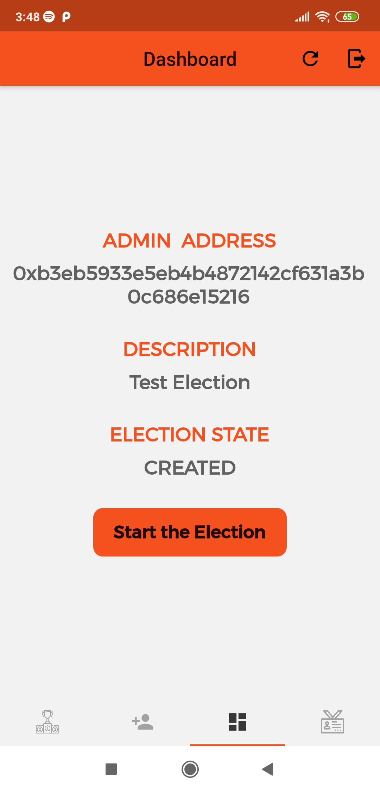&emsp;
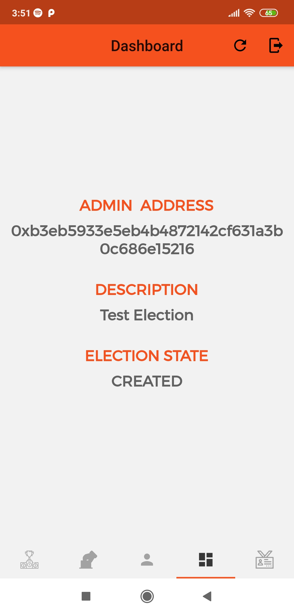&emsp;
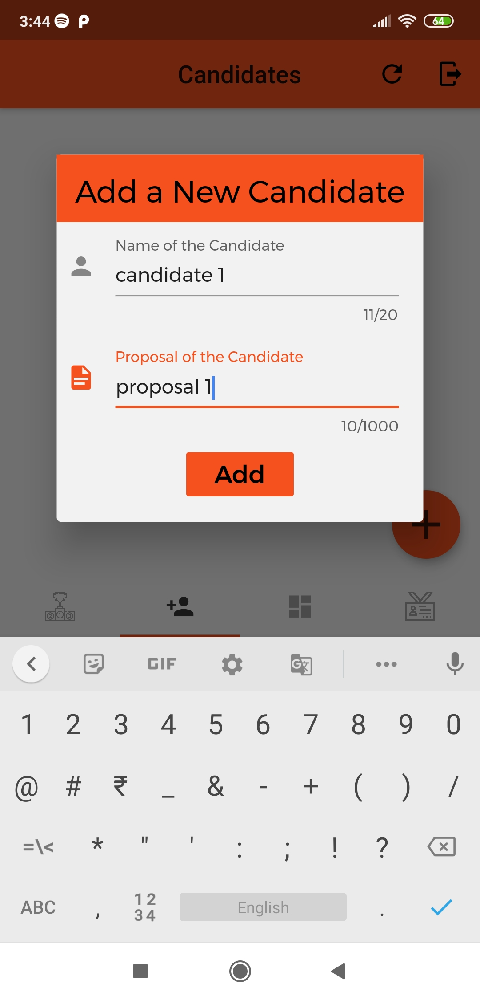&emsp;
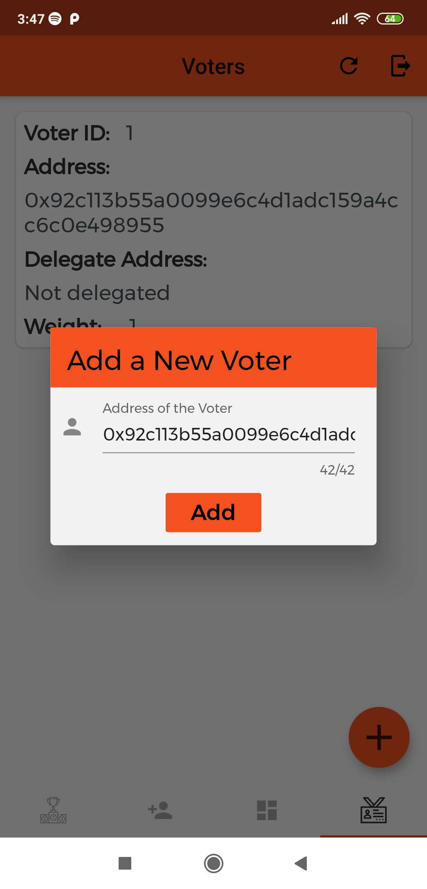&emsp;
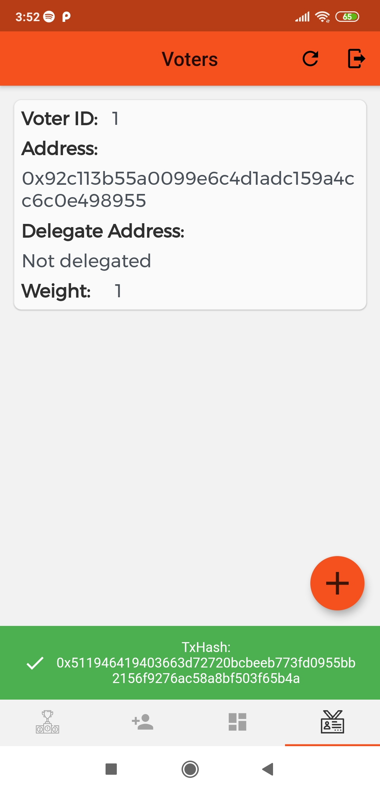&emsp;
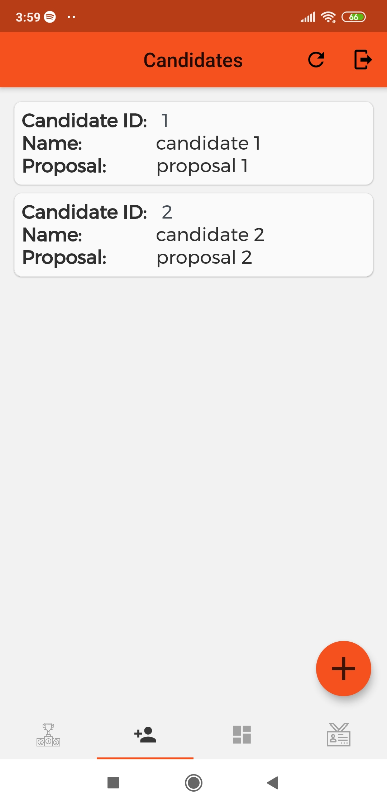&emsp;
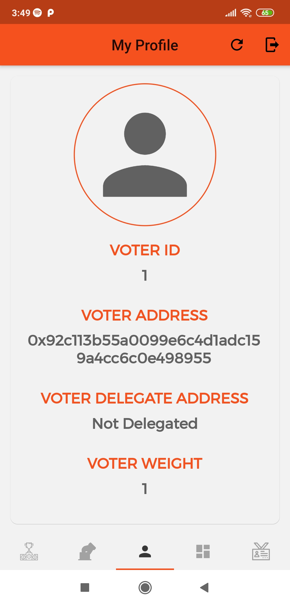&emsp;
&emsp;
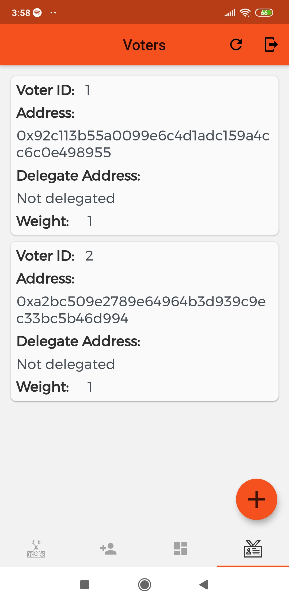&emsp;
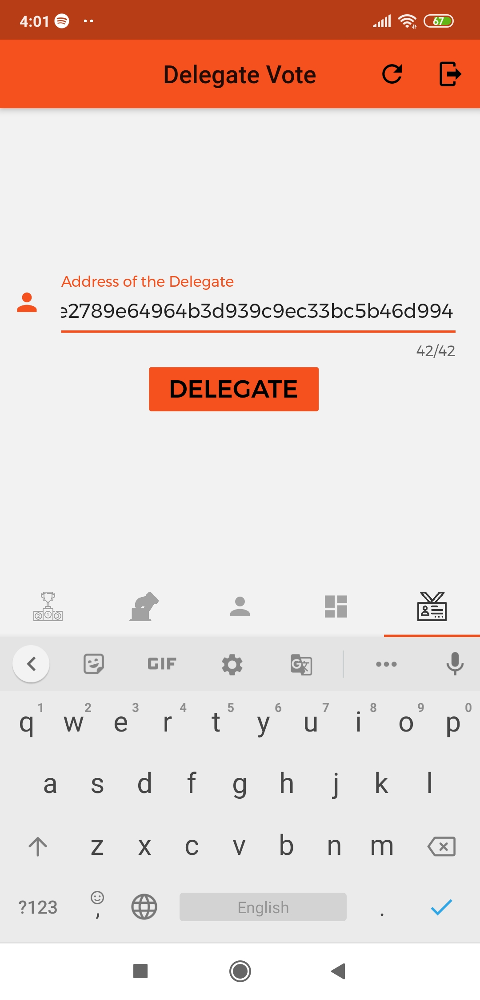&emsp;
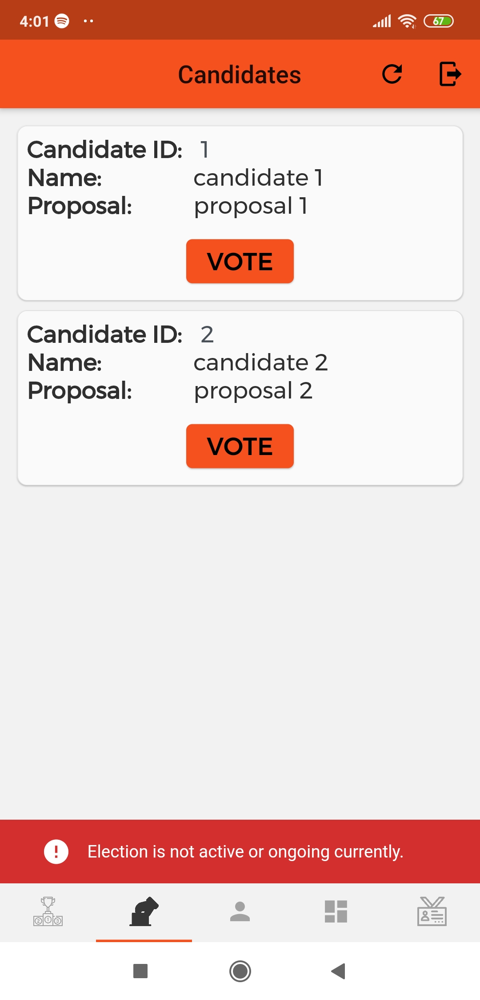&emsp;
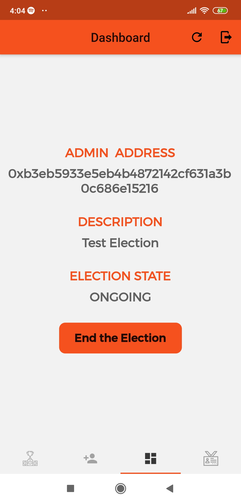&emsp;
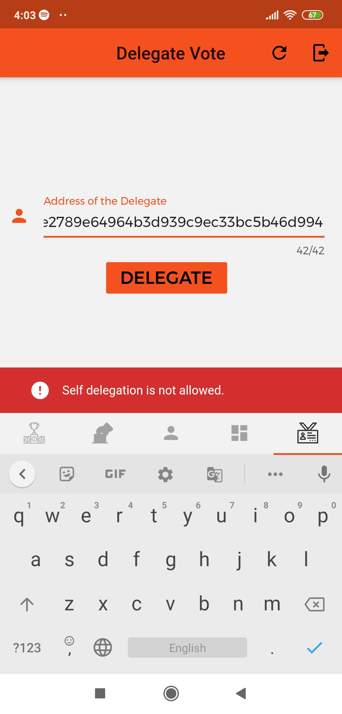&emsp;
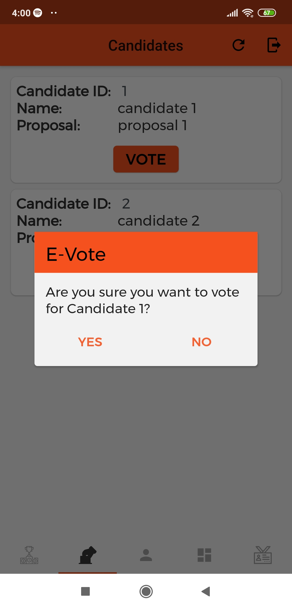&emsp;
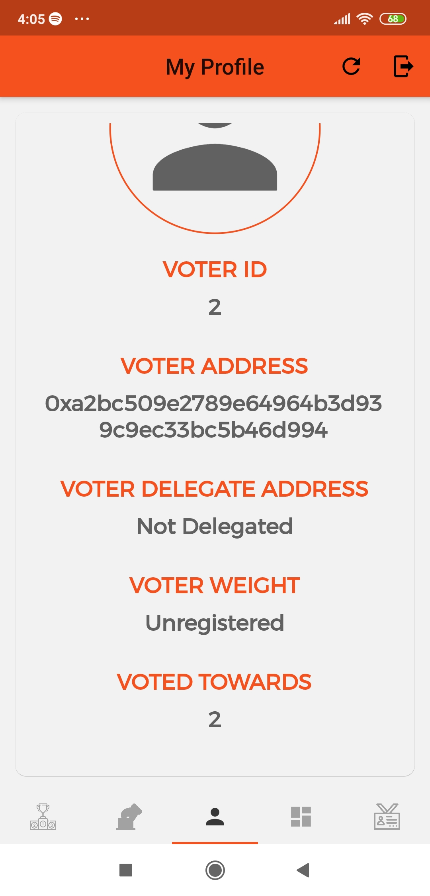&emsp;
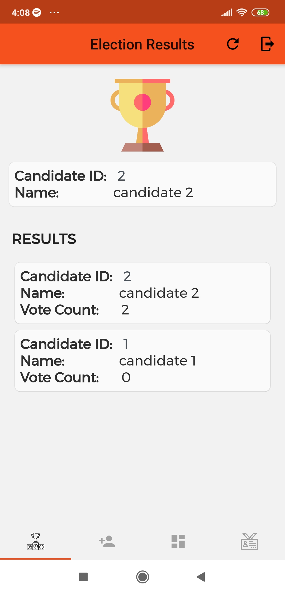&emsp;
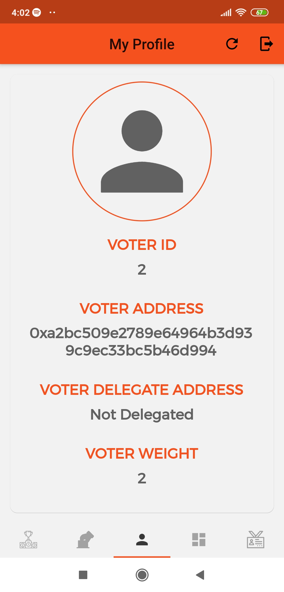&emsp;
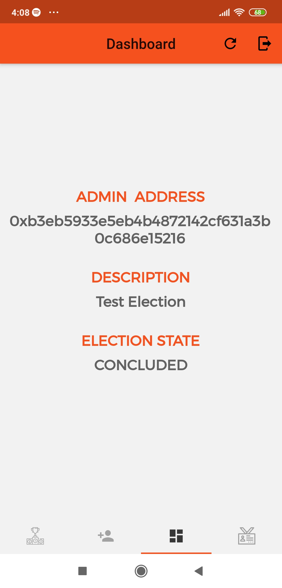&emsp;

